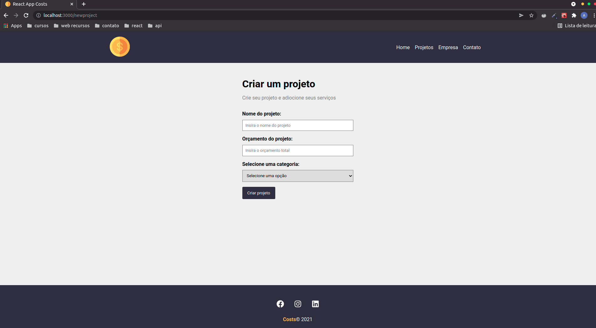
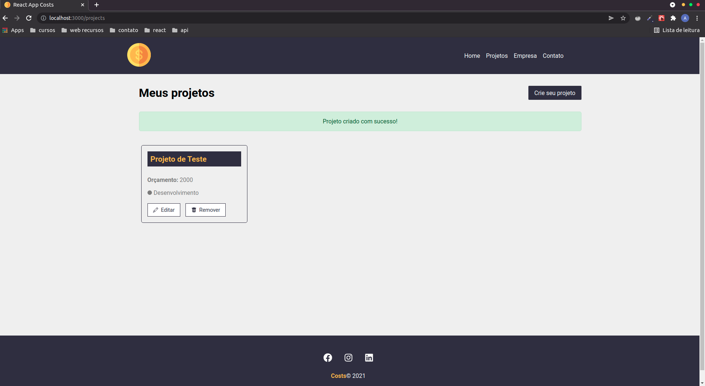
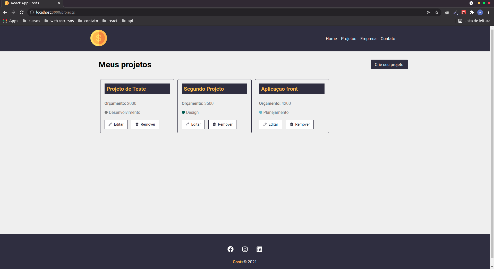
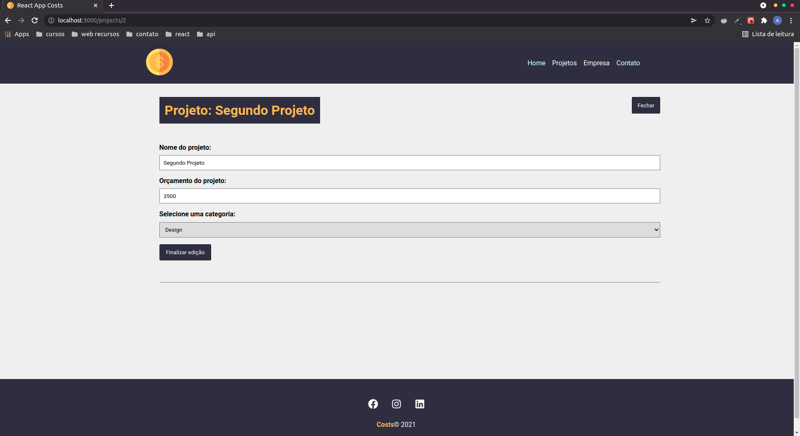
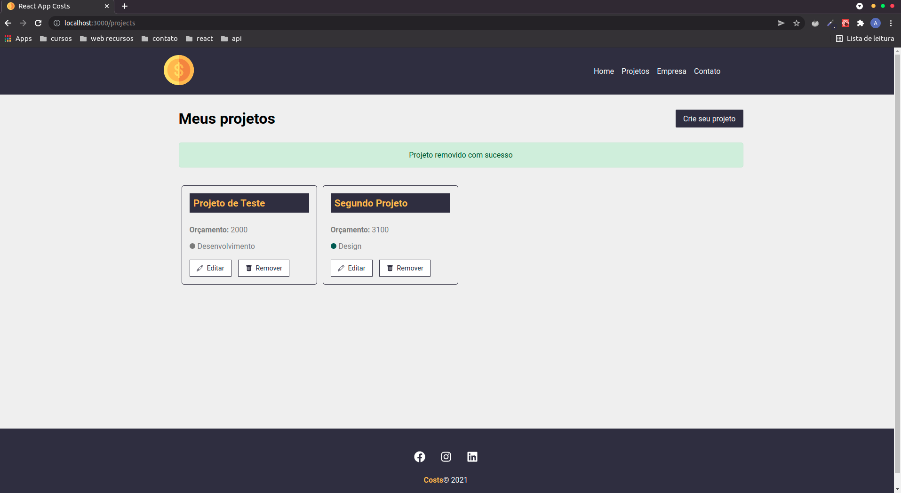
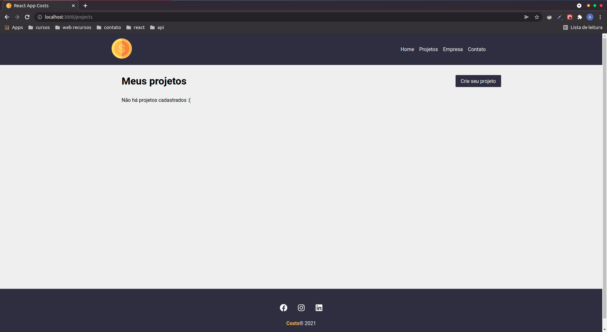

# COST

## Descrição do projeto
Gerenciamento de projetos e gastos com react.js. Aplicativo desenvolvido com react com a finalidade de cadastrar, editar, listar e excluir um projeto. Toda a aplicação foi desenvolvida pensando na componentização, conta com o consumo de uma API 'fake' com json-server para acessar os métodos com o fecth. Esta aplicação conta com navegação, e sistema de rotas passando os 'id' de cada projeto pela url.

Alguns hooks utilizados nesta aplicação, foram:

- useState
- useEffect
- useParams
- useHistory

obs: "Esta é a v1 do projeto, futuramente serão adicionados mais recursos

## Tecnologias utilizadas
- Javascript
- React.js
- Json-server
- Fecth API

## Como utilizar este projeto
- Clone este repositório
- Abra o terminal na pasta do projeto
- No terminal, digite ` npm i ` para instalar as dependências necessárias
- Após instalar as dependências, ainda no terminal, digite o comando ` npm start ` para inicializar o projeto
- Após inicializar o projeto, abra uma nova aba do terminal e execute o comando ` npm run backend ` para inicializar o servidor 

## Comandos necessários
`npm i` = para instalar as dependências
`npm start ` = para inicializar a aplicação ( em ` localhost:3000 `)
`npm run backend ` = para inicializar o servidor 'backend' da aplicação (`json-server`)

## Imagens do projeto

#### Pagina Home

#### Pagina de criação do projeto

#### Pagina de exibição da criação do projeto

#### Pagina de exibição de todos os projetos

#### Pagina de edição do projeto

#### Remoção de um projeto

#### Pagina caso nao exista nenhum projeto

